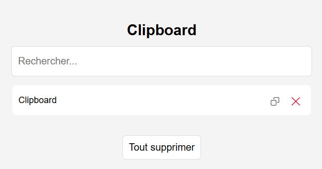

# 📋 Chrome Clipboard Manager

A simple Chrome Extension that saves your copied text snippets and lets you easily manage them — copy again, delete, search, or clear all.

---

##  Features

-  Stores copied text in local storage  
-  Search through saved clips instantly  
-  One-click copy to clipboard  
-  Delete individual clips  
-  Clear all saved clips at once  

---

  

